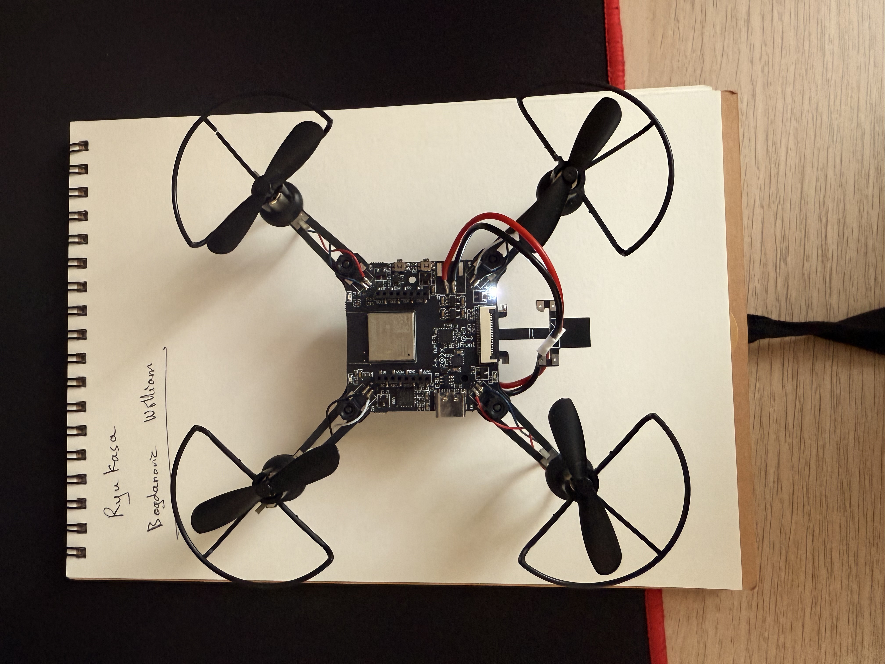

# Sim-to-Real Deployment: ESP-Drone V2.0

## Overview

After training RL policies in MuJoCo simulation, a sim-to-real transfer was attempted on an **ESP-Drone V2.0** (ESP32-S2, Crazyflie-ported firmware) communicating over WiFi/UDP via the CRTP protocol using the [`edlib`](https://github.com/NelsonPython/edlib) Python library.

The objective was to run the trained PPO policy on a host PC, streaming observations from the drone's onboard sensors and sending back motor commands in real time.



## What Was Achieved

### Bidirectional Telemetry at ~64 Hz

A configurable telemetry pipeline was built using the firmware's `LogConfig` interface, streaming the following at ~64 Hz effective rate (100 Hz requested, WiFi overhead reduces throughput):

| Variable | Source | Type |
|---|---|---|
| `gyro.z` | IMU | `float` |
| `acc.z` | IMU | `float` |
| `stabilizer.roll` | Attitude estimator | `float` |
| `stabilizer.pitch` | Attitude estimator | `float` |
| `stabilizer.yaw` | Attitude estimator | `float` |
| `stateEstimate.vz` | Kalman filter | `float` |

The effective telemetry rate was measured empirically: sample count over wall-clock time after streaming, consistently yielding **60–67 Hz** depending on the number of active log groups and WiFi conditions.

The telemetry monitor script is included in this repository at [`esp_telemetry.py`](esp_telemetry.py).

[Watch the demo](https://www.youtube.com/watch?v=xIzPJZqG4Zg)

> **Environment note:** This script depends on `edlib` (ESP-Drone fork of the Crazyflie Python library) and will **not** run under the main MuJoCo environment. Use the dedicated ESP-Drone environment instead:
> ```bash
> conda env create -f environment_espdrone.yaml
> conda activate edclient_py37
> python esp_telemetry.py
> ```
> See [`environment_espdrone.yaml`](environment_espdrone.yaml) for the full dependency list.

### Flight Control from Host PC

Using the telemetry stream, the drone was flown autonomously from a Python control loop on the host:
- Prop test initialization (`health.startPropTest`) to arm motors and set `sys.canfly=1`
- Velocity-level setpoints sent via the firmware's `commander.send_setpoint()` interface at 20 Hz
- Altitude hold achieved by feeding the Kalman-filtered `stateEstimate.vz` into a vertical velocity PID running on the host side

## Hard Blockers for RL Policy Deployment

### 1. Firmware Abstraction Layer

The ESP-Drone firmware (Crazyflie port) exposes a **velocity/attitude-level commander interface**, not direct motor-level access. The onboard stabilizer runs at 500 Hz on the ESP32 and accepts `(roll, pitch, yaw_rate, thrust)` setpoints.

The trained PPO policy outputs **raw motor commands** (4 floats, one per rotor). Injecting these requires either:
- Modifying the firmware to expose a motor-level commander mode, bypassing the onboard PID
- Or rewriting the control stack — feasible since the firmware is open source (Apache 2.0), but a significant embedded systems effort outside the project's initial scope

### 2. WiFi/UDP Latency

Even with the firmware constraint aside, the communication latency is fundamentally insufficient for a micro-drone of this size (~12 cm diagonal):

| Metric | Measured |
|---|---|
| Telemetry rate (effective) | ~64 Hz |
| Command rate | 20 Hz |
| WiFi round-trip (best case) | ~15 ms |
| Required control rate for stable micro-drone flight | >200 Hz |

At 20 Hz command rate with velocity-level setpoints, the drone holds altitude (the onboard PID handles attitude stabilization), but lateral drift accumulates between host-side updates and is unrecoverable at this rate without an external positioning system (e.g., Vicon/OptiTrack). The drift was confirmed experimentally — the drone flies, but deviates from intended trajectories within seconds.

## Paths Forward

Deploying the RL policy on this platform would require one of:
1. **Onboard inference** — deploy a quantized policy directly on the ESP32 (constrained by 320 KB SRAM, no FPU on ESP32-S2), eliminating the communication bottleneck entirely
2. **Low-latency radio link** — replace WiFi with a dedicated 2.4 GHz radio (e.g., Crazyradio PA) for sub-millisecond round-trips, combined with firmware modification for motor-level access
3. **Larger platform** — a heavier drone with slower dynamics would tolerate ~15 ms latency, reducing the required control rate to a feasible range

The simulation pipeline, trained policies, and telemetry infrastructure are all in place. The remaining gap is a firmware and hardware integration effort.